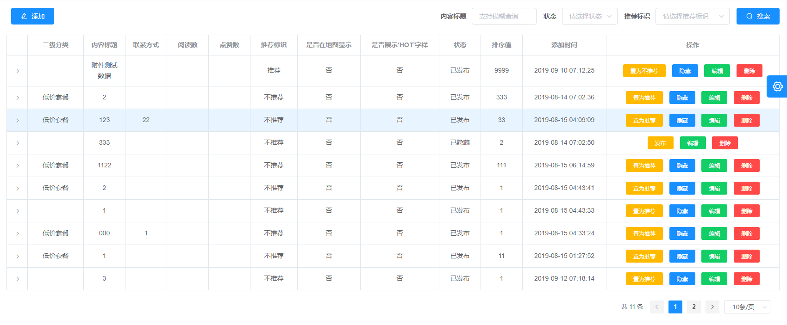
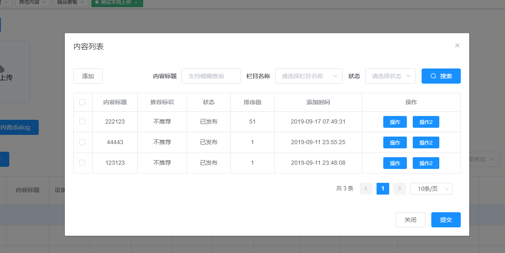

最新更新 {docsify-updated}

##### 组件下载

你需要将svn地址wdt-frontend-element-ui下的所有项目全部下载到本地

##### npm 安装

首先需要在下载到本地的wdt-element-ui-ueditor-content目录下执行 npm install

?> 推荐使用 npm 的方式安装，`强烈建议不要直接使用 cnpm 安装，可能会有各种诡异 bug`

然后在你需要该组件的项目根目录(即package.json存在的目录)下执行：

```
npm install ../wdt-element-ui-ueditor-content
```

## 在项目中引入内容相关组件

你可以引入整个内容组件，或是根据需要仅引入部分组件。我们先介绍如何引入完整的内容组件

##### 完整引入

在 main.js 中写入以下内容：

```
import Vue from 'vue'
import contentPlugin from '@wdt/wdt-element-ui-ueditor-content'

Vue.use(contentPlugin)
```

##### 按需引入

你可以只引入需要的组件。比如 ContentPageDialog 组件，只需要在需要的地方写入如下内容：

```
import Vue from 'vue'
import contentPlugin from '@wdt/wdt-element-ui-ueditor-content'
Vue.use(contentPlugin.ContentPageDialog)
```

## 内容列表组件 - ContentManage

默认包含内容列表全部增删改查功能的列表组件

##### 先看效果



##### 再看代码

```
<ContentManage
  fun-column-min-width="330px"
  :param-type-code="'tssClient'"
  :show-tab-selection="false"
  :tab-sel-list="['5d76177928b6e9667b53503c', '5d527cad32ef473f50129c2e']"
  :out-exp-obj="outExpObj"
  @table-selection-change="selChange"
  @table-expand-change="tabExpandChange"
>
  <!-- 搜索栏左侧按钮插槽 -->
  <template #fun-button>
    <el-button type="primary">添加啊啊</el-button>
  </template>
  <!-- 内容table操作列插槽 -->
  <template #operatorbtn="{ row }">
    <el-button type="primary" size="mini" @click="click(row)">操作</el-button>
    <el-button type="primary" size="mini" @click="click(row)">操作2</el-button>
  </template>
</ContentManage>

<script>
export default {
  data() {
    return {
      outExpObj: {}
    }
  },
  methods: {
    selChange(val) {
      console.log('upload selChange', val)
    },
    tabExpandChange(row, expand) {
      if (expand && expand.length) {
        this.outExpObj[row._id] = [
          {
            label: '设备名称',
            value: row._id
          }
        ]
      }
    }
  }
}
</script>

```

##### 组件的属性列表

|          属性          |    类型     |  默认值 |            说明              |
| ---------------------- | -------------- | ---------- | ----------------------------|
|   paramTypeCode    |   String / Array |   ''    |    栏目编码或编码数组，只查询传入栏目数据，若为String，默认搜索条件不显示栏目，若为Array，则搜索条件只允许选择传入的栏目       |
|   showSearch           |   Boolean  |   true  |    是否显示顶部搜索条件       |
|   showTabSelection     |   Boolean  |   false |    是否显示表格左侧复选框     |
|   funColumnMinWidth    |   String   |   330px |  表格右侧操作列最小宽度，方便自定义操作按钮时进行自定义宽度 |
|    tabSelList          |   Array    |   []    |  默认选中内容行_id列表        |
|    outUrl          |   String    |   ''    |  列表请求url，若传入此参数，则会覆盖原有请求url        |
|    outParam          |   Object    |   {}    |  列表请求参数，若传入outUrl,则完全替换原有请求参数，若不传outUrl,则会覆盖原有请求参数中存在的属性,`注意：不需要传入分页参数`        |
|    outExpObj          |   Object    |   {}    |  展开行需要额外展示的数据，数据结构参考`附录2`   |
|    showOperation      |   Boolean    |   false    |  是否显示组件原操作按钮。只有有自定义操作按钮插槽时起作用   |

##### 组件的事件列表

| 事件 | 触发条件 | 参数内容 |
| ---- | ---- | ------ |
|  table-selection-change    |   选中或取消选中行时触发事件   |  选中行对象,参考`附录1 `  |
|  table-expand-change    |   当对某一行展开或关闭时触发事件   |  参数1：行对象,参考`附录1 `；参数2：展开行列表，一般根据这个参数判断是展开还是关闭  |

##### 附录1：选中行对象示例(只作参考，实际对象属性根据栏目配置字段而定)

```
{
content: "<p>111</p>",
cover_img: ["5d7617b828b6e9667b535043"],
create_by: "5cbec36de944b2236ce406c9",
create_date: 1568020345985,
del_flag: false,
hot_flag: "0",
lat: "36.139839",
lng: "120.406881",
namespace: "vtsc",
recommend_flag: "1",
show_map: "0",
sort: 9999,
status: "1",
title: "附件测试数据",
type_code: "10",
update_by: "5cbec36de944b2236ce406c9",
update_date: 1568717624416,
video: ["5d76176728b6e9667b535036", "5d76177028b6e9667b535039"],
zoom: 1,
_id: "5d76177928b6e9667b53503c"
}
```

##### 附录2：展开行需要额外展示的数据(请严格按照以下数据格式，否则可能会导致展示异常)

```
// {行_id: 额外展示数据数组}
{
5d76176728b6e9667b535036: [
    {
      label: '所属组织', // 展示标题
      value: '全部终端' // 展示内容
    }
  ]
}
```

##### 插槽

| 事件 | 触发条件 | 参数内容 |
| ---- | ---- | ------ |
|  fun-button    |   搜索栏左侧自定义操作按钮   | 无 |
|  operatorbtn   |   列表行右侧自定义操作按钮   |    行对象,参考`附录1 `    |


## 内容列表弹窗组建 - ContentPageDialog


包含基本查询功能的内容列表弹窗，可自定义功能

##### 先看效果



##### 再看代码

```
<ContentPageDialog
  v-model="showDialog"
  title="内容列表"
  show-tab-selection
  fun-column-min-width="180px"
  :tab-sel-list="['5d76177928b6e9667b53503c', '5d527cad32ef473f50129c2e']"
  @table-selection-change="selChange"
>
  <!-- 弹窗上部按钮插槽 -->
  <template #tab-fun-button>
    <el-button>添加</el-button>
  </template>
  <!-- 内容table操作列插槽 -->
  <template #tab-ope-btn="{ row }">
    <el-button type="primary" size="mini" @click="click(row)">操作</el-button>
    <el-button type="primary" size="mini" @click="click(row)">操作2</el-button>
  </template>
  <!-- dialog底部插槽 -->
  <template #footer>
    <el-button @click="showDialog = false">关闭</el-button>
    <el-button type="primary" @click="showDialog = false">提交</el-button>
  </template>
</ContentPageDialog>
```

##### 组件的属性列表

|          属性          |    类型     |  默认值 |            说明              |
| ---------------------- | -------------- | ---------- | ----------------------------|
|   value    |   Boolean |   false    |    是否显示弹窗     |
|   title           |   String  |   内容列表  |    弹窗标题       |
|   paramTypeCode    |   String / Array |   ''    |    栏目编码或编码数组，只查询传入栏目数据，若为String，默认搜索条件不显示栏目，若为Array，则搜索条件只允许选择传入的栏目       |
|   showTabSelection     |   Boolean  |   false |    是否显示表格左侧复选框     |
|   funColumnMinWidth    |   String   |   330px |  表格右侧操作列最小宽度，方便自定义操作按钮时进行自定义宽度 |
|    tabSelList          |   Array    |   []    |  默认选中内容行_id列表        |
|    outUrl          |   String    |   ''    |  列表请求url，若传入此参数，则会覆盖原有请求url        |
|    outParam          |   Object    |   {}    |  列表请求参数，若传入outUrl,则完全替换原有请求参数，若不传outUrl,则会覆盖原有请求参数中存在的属性,`注意：不需要传入分页参数`        |

##### 组件的事件列表

| 事件 | 触发条件 | 参数内容 |
| ---- | ---- | ------ |
|  table-selection-change    |   选中或取消选中行时触发事件   |  选中行对象,参考`附录1 `  |

##### 附录1：选中行对象示例(只作参考，实际对象属性根据栏目配置字段而定)

```
{
content: "<p>111</p>",
cover_img: ["5d7617b828b6e9667b535043"],
create_by: "5cbec36de944b2236ce406c9",
create_date: 1568020345985,
del_flag: false,
hot_flag: "0",
lat: "36.139839",
lng: "120.406881",
namespace: "vtsc",
recommend_flag: "1",
show_map: "0",
sort: 9999,
status: "1",
title: "附件测试数据",
type_code: "10",
update_by: "5cbec36de944b2236ce406c9",
update_date: 1568717624416,
video: ["5d76176728b6e9667b535036", "5d76177028b6e9667b535039"],
zoom: 1,
_id: "5d76177928b6e9667b53503c"
}
```

##### 插槽

| 事件 | 触发条件 | 参数内容 |
| ---- | ---- | ------ |
|  fun-button    |   搜索栏左侧自定义操作按钮   | 无 |
|  tab-ope-btn   |   列表行右侧自定义操作按钮   |    行对象,参考`附录1 `    |
|  footer    |   弹窗按钮操作区的内容   | 无 |
