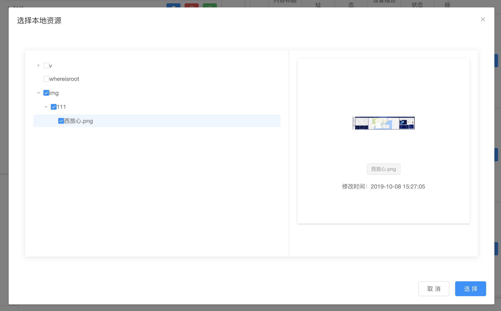

最新更新 {docsify-updated}

## 组件下载和引入

##### 添加依赖
* 本组件项目的名称为：vtsc-component-resource；
* 将组件项目下载到需要运行项目的同级目录下；
* 进入组件项目vtsc-component-resource根目录(即package.json所在的目录)，执行npm install；
* 进入需要运行项目的根目录下(即package.json所在的目录)，添加本组件的依赖：
```
npm install ../vtsc-component-resource
```

##### 引入组件
你可以引入整个本地资源管理组件，或是根据需要仅引入部分组件：

###### 完整引入

在 main.js 中写入以下内容：

```
import Vue from 'vue'
import resourceManage from '@vtsc/vtsc-component-resource'

Vue.use(resourceManage)
```

###### 按需引入

你可以只引入需要的组件。比如 ResourceSelect 组件，只需要在需要的地方写入如下内容：

```
import Vue from 'vue'
import resourceManage from '@vtsc/vtsc-component-resource'
Vue.use(resourceManage.resourceSelect)
```

## 选择本地资源弹窗 - ResourceSelect

选择本地文件，需要注意以下几点：
> * 选中的文件夹不会返回；
> * 如果需要选中某个文件夹下的所有文件，需要点击展开按钮，将该文件夹展开后再选中，因为文件树是懒加载的；

##### 先看效果



##### 再看代码

```
<template>
  <div>
    <el-button @click="test">test</el-button>
    <ResourceSelect ref="resourceSelect" @getSelectFile="getSelectFile" />
  </div>
</template>

<script>
export default {
  name: 'OrgIndex',
  data() {
    return {
      fileList: []
    }
  },
  methods: {
    // 打开弹窗
    test() {
      this.$refs.resourceSelect.openSelect()
    },
    // 返回选中的文件列表
    getSelectFile(selectFile) {
      this.fileList = selectFile
    }
  }
}
</script>

```

##### 组件的方法列表

|          名称          |    说明     |            参数              |
| ---------------------- | -------------- | ----------------------------|
| openSelect | 打开弹窗 | 无 |

##### 组件的事件列表

|          名称          |    说明     |            参数              |
| ---------------------- | -------------- | ----------------------------|
| getSelectFile | 返回选中的文件列表 | selectFile：选中的文件列表 |

## 展示本地资源组件 - ResourceShow

展示选中的文件

##### 结合 ResourceSelect组件 使用的代码

```
<template>
  <div>
    <el-button @click="test">test</el-button>
    <!-- ResourceShow组件 -->
    <ResourceShow :img-style="imgStyle" :file-list="fileList" />
    <ResourceSelect ref="resourceSelect" @getSelectFile="getSelectFile" />
  </div>
</template>

<script>
export default {
  name: 'OrgIndex',
  data() {
    return {
      imgStyle: {
        width: '300px',
        height: '300px',
        border: '1px solid grey'
      },
      fileList: []
    }
  },
  methods: {
    test() {
      this.$refs.resourceSelect.openSelect()
    },
    getSelectFile(selectFile) {
      this.fileList = selectFile
    }
  }
}
</script>
```

##### 组件的属性列表

|          属性          |    类型     |  默认值 |            说明              |
| ---------------------- | -------------- | ---------- | ----------------------------|
| containStyle | Object | { display: 'inline-block' } | 展示组件外层容器的样式 |
| imgStyle | Object | { width: '150px', height: '150px', border: '1px solid grey' } | 图片容器的样式 |
| imgFit | String | fill | 图片的填充方式，支持：fill / contain / cover / none / scale-down，可参考Element的Image组件的fit属性 |
| fileList | Array | [] | 展示的文件对象数组，文件对象的isDirectory、fileType、path属性不可以为空，数据结构参考`附录1`  |

##### 附录1：文件对象
```
{
    fileType: "images",
    isDirectory: false,
    isHidden: false,
    loading: false,
    modifiedTime: 1570519625000,
    name: "西旅心.png",
    parentPath: "/root/vtscfiles/img/111",
    path: "/root/vtscfiles/img/111/西旅心.png",
    suffix: "png"
}
```